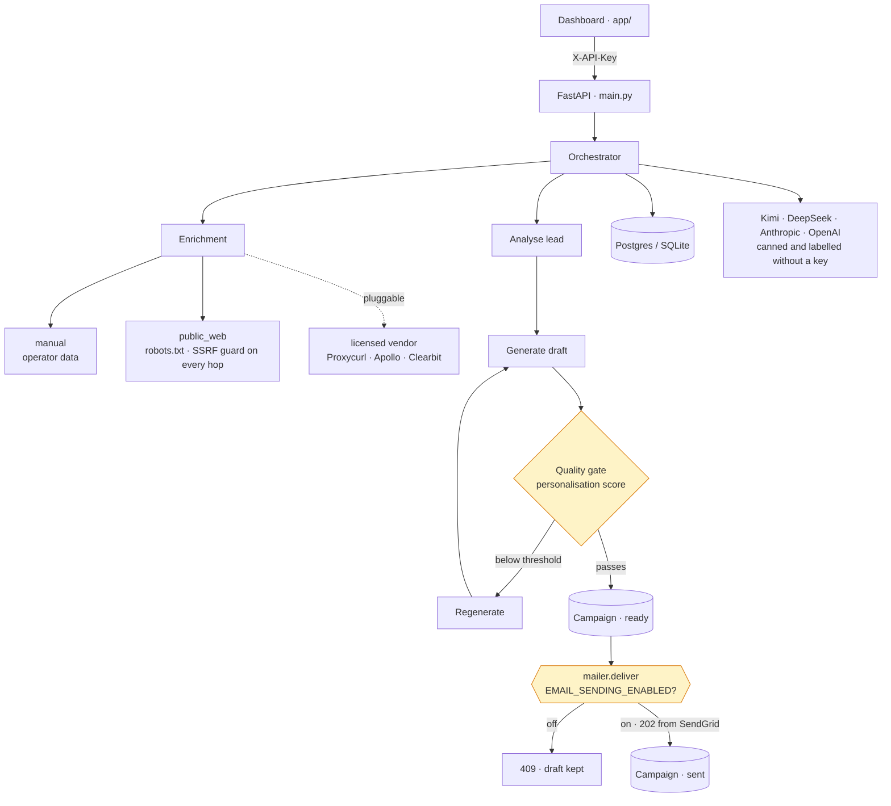

# Outreach Architect

Research-assisted personalisation for cold outreach: enrich a lead from sources
you are licensed to use, draft an opener with an LLM, score the draft against a
quality bar, and hold it for review before anything is sent.

[](https://github.com/daniellopez882/Outreach-Pro-Agent/actions/workflows/ci.yml)

> **On the numbers.** An earlier version of this README claimed the system
> "achieves 15-20% response rates" and published a table of open, response and
> meeting rates; the landing page repeated them with testimonials, pricing and an
> ROI calculator. Nothing in this repository measures any of that, and no
> campaign has been run with it. Those claims are gone from the README, the
> OpenAPI description, the analytics route and the page. Where a number appears
> here now, the command that produced it appears beside it.

---

## Why this exists

Personalising cold outreach at volume is a research problem before it is a
writing problem. Most of the work is finding something true and specific to say
about a company, and knowing when you have not found it. This project treats
that as a pipeline with a quality gate, rather than a prompt.

## Architecture



## Data sourcing

This is the part worth reading, and the largest change in the current revision.

**The project no longer scrapes sites whose terms forbid it**, and that is
enforced in code rather than advised in a comment. `enrichment/registry.py`
refuses to construct any provider flagged non-compliant, `public_web` honours
`robots.txt` and identifies itself truthfully, and tests fail the build if
either control is removed.

`linkedin_scraper.py` has been deleted. It logged in with a username and
password, and it never worked: no CSRF token, redirects not followed by
`httpx.Client`, and a success check (`'feed' in response.url`) that raises
`TypeError` into a bare `except`. `login()` could only return `False`, and the
unauthenticated fetches that followed were parsing LinkedIn's login wall as
though it were profile data.

Full detail, including how to plug in a licensed vendor:
**[docs/data-sourcing.md](outreach-architect/docs/data-sourcing.md)**.

## What was fixed

Reproduced on the original code before each fix; every row has a test.

### In the pull request

| Defect | Consequence |
|---|---|
| Every endpoint unauthenticated, including `POST /campaigns/{id}/send` | Anyone who could reach the port could **send email from your SendGrid account** |
| `Base.metadata.create_all()` at module import | Importing any module opened a DB connection and created tables; nothing could be imported for a test, and the schema bypassed Alembic |
| `database_url`, `redis_url`, `sendgrid_api_key`, `from_email`, `from_name` all required | The app could not be imported without a full production environment |
| `allow_origins=["*"]` with `allow_credentials=True` | A combination browsers reject outright |
| `company_intelligence.py` used `re` without importing it | `NameError` on every hiring-signal lookup, swallowed by `except Exception` and reported as "no data" |
| `company_website` passed straight to `httpx.get` | SSRF: a lead-supplied URL could reach `169.254.169.254` and read cloud instance credentials |
| OpenAPI description read "15-20% response rates" | An unmeasured claim served as a property of the software |
| `Dockerfile` ran as root with `--reload` | Reloader in production; healthcheck probed `/` rather than a liveness endpoint |
| `datetime.utcnow()` throughout, including SQLAlchemy column defaults | Deprecated since 3.12; naive datetimes compare wrong against aware ones |
| No CI, no tests | — |

### Found while writing the threat model

| Defect | Consequence |
|---|---|
| `_send_email` set a campaign to `SENT` without reading `EMAIL_SENDING_ENABLED` and without contacting a provider | The documented opt-in was a setting nothing read; every "sent" campaign had not been sent. Now: `mailer.deliver` checks the gate first, `SENT` only after SendGrid answers 202, and the route answers 409 / 503 / 502 with the row unchanged ([ADR 0003](outreach-architect/docs/adr/0003-delivery-is-one-gated-function.md)) |
| `KimiAgent.__init__` built `OpenAI(api_key=None)` at import | With no model key the import raised, so `POST /campaigns` and the send route answered 500 and the documented canned fallback was unreachable. The client is built on first use; canned output is marked `generated_by: "canned"` |
| `public_web` fetched with `follow_redirects=True` after checking only the first host | A public site's `302` to `http://169.254.169.254/` was followed straight past the SSRF guard. Redirects are now followed by hand, each hop re-checked, at most three |
| `lead_ids` unbounded on `POST /campaigns` | One authenticated request could run up the model bill without limit; bounded to 100, enforced before any model call |
| `/analytics/stats` served `"target_response_rate": "15-20%"` | A marketing figure in an API response; removed |
| The dashboard called the API with no key, and its cards showed "+2 since last hour", "Target: 15-20%" and "Kimi 2.5 Logic Running" as constants | Empty tables once the routes were protected; invented numbers in the UI. It now sends the key, reads `/ready`, shows only counts from the database, and every control does something |
| The landing page published "18% average response rate", "42% open rate", "10,000+ leads/day", "13,100% ROI", three testimonials and three price tiers | None was backed by anything; replaced with a description of what runs and a list of what it does not do |
| 18 known advisories in five pinned packages (`fastapi`, `starlette`, `requests`, `jinja2`, `python-dotenv`) | Upgraded; `pip-audit` reports none and now runs in CI with `bandit` |

## Quick start

```bash
git clone https://github.com/daniellopez882/Outreach-Pro-Agent.git
cd Outreach-Pro-Agent/outreach-architect
cp .env.example .env
python -m venv .venv && .venv/bin/pip install -r requirements-dev.txt
.venv/bin/pytest
.venv/bin/uvicorn main:app --reload
```

SQLite is the default, so a fresh clone runs with no database to set up. The
frontend lives in `app/` (Vite + React): `cp .env.example .env.local`, set
`VITE_API_KEY` to the backend's key (or enter it in the page), then
`npm ci && npm run dev`.

## API

Everything except the probes requires `X-API-Key`.

| Method | Path | Auth | Purpose |
|---|---|---|---|
| GET | `/health` | none | Liveness. Touches no dependency. |
| GET | `/ready` | none | Readiness: database reachable, key configured, whether delivery is enabled |
| POST | `/leads` | key | Create a lead |
| GET | `/leads` | key | List leads |
| POST | `/campaigns` | key | Run the pipeline and draft campaigns for up to 100 leads; drafts are held as `ready` |
| POST | `/campaigns/{id}/send` | key | **Deliver through SendGrid.** `409` while `EMAIL_SENDING_ENABLED` is false, `503` if enabled but unconfigured, `502` if the provider refuses; `sent` only on a 202 |
| GET | `/analytics/stats` | key | Counts from the database: leads, campaigns, sent, replied, replied ÷ sent |

## Configuration

See [`.env.example`](outreach-architect/.env.example).

| Variable | Default | Notes |
|---|---|---|
| `API_KEY` | `changeme-in-production` | **Rejected** when `ENVIRONMENT=production` |
| `ENVIRONMENT` | `development` | `production` also requires non-SQLite and non-empty CORS |
| `EMAIL_SENDING_ENABLED` | `false` | Sending is the one irreversible action; opt in deliberately |
| `SENDGRID_API_KEY`, `FROM_EMAIL`, `FROM_NAME` | unset | Required once sending is enabled; production refuses to start without them |
| `ENRICHMENT_PROVIDERS` | `manual` | Ordered list; see data-sourcing doc |
| `DATABASE_URL` | SQLite in the repo dir | Postgres for anything real |
| `KIMI_API_KEY` / `DEEPSEEK_API_KEY` | unset | Without either, drafts are canned responses marked as such |

## Testing

```bash
cd outreach-architect && pytest
```

93 tests, all offline (`93 passed` on 2026-09-06). There were none before the
pull request, 64 after it. They cover the enrichment providers and their
compliance gate, the SSRF guard including redirects, API authentication on
every protected route, the delivery gate through a fake SendGrid transport,
the model client's no-key path, the batch bound, the readiness checks, and an
assertion that neither the OpenAPI description nor the analytics route carries
an unmeasured performance claim.

The frontend has no tests; CI lints and builds it.

## Security

Implemented: constant-time API key comparison on every data and action
endpoint; SSRF guards on server-side fetches, applied to every redirect hop;
configurable CORS allowlist; non-root container; production configuration
validated at startup; email delivery disabled by default and enforced in code;
`pip-audit` and `bandit` in CI; a bound on the work one request can ask for.

**Not implemented:** per-user accounts (a single shared API key), rate limiting
on the HTTP API (the setting exists but is not wired to a limiter), and audit
logging of who sent what. The threat model lists what remains open:
[docs/threat-model.md](outreach-architect/docs/threat-model.md).

## Limitations

- **No response-rate data exists.** No campaign has been run with this. Any
  effectiveness claim would be invented.
- **The LLM agent falls back to canned responses** when no provider key is set,
  and marks them `generated_by: "canned"` in its output and in the campaign's
  `model_used` column.
- **No email compliance tooling.** No suppression list, unsubscribe handling or
  consent record. Cold outreach is regulated (CAN-SPAM, GDPR/PECR, CASL) and
  this project does not help you comply; that is why sending is off by default.
- **The dashboard holds the API key in the browser** (`VITE_API_KEY` in the
  bundle, or `sessionStorage`). Anyone who can open the page can read it; it is
  a single-operator tool.
- **Alembic is a dependency but there are no migrations.** SQLite schemas are
  created at startup; Postgres deployments need migrations written first.
- **No evaluation harness** for draft quality. The personalisation score is the
  model scoring its own output.
- **The frontend is untested.** CI lints and builds it; nothing asserts its behaviour.

## Roadmap

1. Evaluation set for draft quality, scored by something other than the generator
2. Alembic migrations, so Postgres is deployable
3. Suppression list and unsubscribe handling before sending is recommended
4. Per-tenant API keys and rate limiting
5. A licensed enrichment provider wired in as a reference implementation

## Documentation

| Document | What it records |
|---|---|
| [ADR 0001](outreach-architect/docs/adr/0001-every-action-route-authenticates-and-sending-is-opt-in.md) | Every data and action route authenticates; sending mail is opt-in |
| [ADR 0002](outreach-architect/docs/adr/0002-enrichment-providers-behind-a-terms-compliance-gate.md) | Enrichment providers behind a terms-compliance gate, with an SSRF guard |
| [ADR 0003](outreach-architect/docs/adr/0003-delivery-is-one-gated-function.md) | Delivery is one gated function; a campaign is `sent` only when the provider says so |
| [Threat model](outreach-architect/docs/threat-model.md) | Assets, boundaries, eleven threats with what was open, what is closed and what remains |
| [Data sourcing](outreach-architect/docs/data-sourcing.md) | What is fetched, what is refused, how to add a licensed provider |

## Repository layout

```
.github/workflows/     CI (at the root, so it runs): lint · tests · audit · scan · frontend build · container boot and probes
app/                   Vite + React dashboard; src/lib/api.ts is the one place that calls the API
outreach-architect/
  main.py              FastAPI app, auth, probes, send route
  orchestrator.py      enrich -> analyse -> generate -> quality gate -> campaign; send_campaign_email
  mailer.py            SendGrid delivery behind the EMAIL_SENDING_ENABLED gate
  kimi_agent.py        LLM client, built on first use, canned fallback labelled
  enrichment/          provider interface, manual + public_web, registry gate
  company_intelligence.py
  models.py            SQLAlchemy models
  config.py            typed settings with production validation and the delivery gate
  docs/                data-sourcing policy, ADRs, threat model
  tests/
```

## License

MIT — see [LICENSE](LICENSE).
