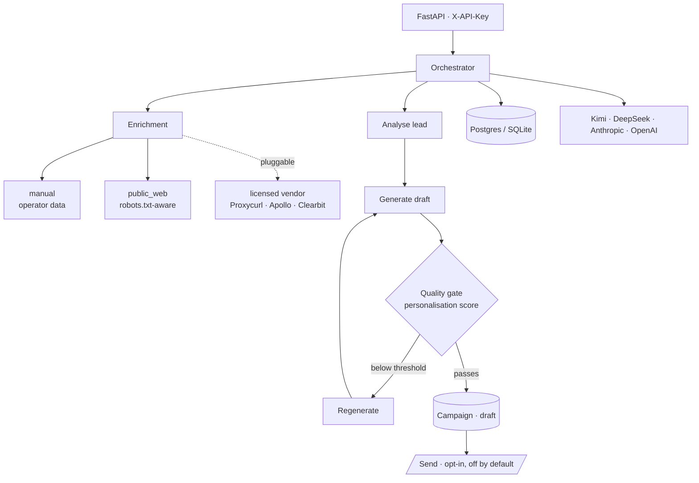

# Outreach Architect

Research-assisted personalisation for cold outreach: enrich a lead from sources
you are licensed to use, draft an opener with an LLM, score the draft against a
quality bar, and hold it for review before anything is sent.

[](https://github.com/daniellopez882/Outreach-Pro-Agent/actions/workflows/ci.yml)

> **On the numbers.** An earlier version of this README claimed the system
> "achieves 15-20% response rates" and published a table of open, response and
> meeting rates. Nothing in this repository measures any of those, and no
> campaign has been run with it. Those claims are gone. Where a number appears
> here now, the command that produced it appears beside it.

---

## Why this exists

Personalising cold outreach at volume is a research problem before it is a
writing problem. Most of the work is finding something true and specific to say
about a company, and knowing when you have not found it. This project treats
that as a pipeline with a quality gate, rather than a prompt.

## Architecture



## Data sourcing

This is the part worth reading, and the largest change in the current revision.

**The project no longer scrapes sites whose terms forbid it**, and that is
enforced in code rather than advised in a comment. `enrichment/registry.py`
refuses to construct any provider flagged non-compliant, `public_web` honours
`robots.txt` and identifies itself truthfully, and tests fail the build if
either control is removed.

`linkedin_scraper.py` has been deleted. It logged in with a username and
password, and it never worked: no CSRF token, redirects not followed by
`httpx.Client`, and a success check (`'feed' in response.url`) that raises
`TypeError` into a bare `except`. `login()` could only return `False`, and the
unauthenticated fetches that followed were parsing LinkedIn's login wall as
though it were profile data.

Full detail, including how to plug in a licensed vendor:
**[docs/data-sourcing.md](outreach-architect/docs/data-sourcing.md)**.

## What was fixed

| Defect | Consequence |
|---|---|
| Every endpoint unauthenticated, including `POST /campaigns/{id}/send` | Anyone who could reach the port could **send email from your SendGrid account** |
| `Base.metadata.create_all()` at module import | Importing any module opened a DB connection and created tables; nothing could be imported for a test, and the schema bypassed Alembic |
| `database_url`, `redis_url`, `sendgrid_api_key`, `from_email`, `from_name` all required | The app could not be imported without a full production environment |
| `allow_origins=["*"]` with `allow_credentials=True` | A combination browsers reject outright |
| `company_intelligence.py` used `re` without importing it | `NameError` on every hiring-signal lookup, swallowed by `except Exception` and reported as "no data" |
| `company_website` passed straight to `httpx.get` | SSRF: a lead-supplied URL could reach `169.254.169.254` and read cloud instance credentials |
| OpenAPI description read "15-20% response rates" | An unmeasured claim served as a property of the software |
| `Dockerfile` ran as root with `--reload` | Reloader in production; healthcheck probed `/` rather than a liveness endpoint |
| `datetime.utcnow()` throughout, including SQLAlchemy column defaults | Deprecated since 3.12; naive datetimes compare wrong against aware ones |
| No CI, no tests | — |

## Quick start

```bash
git clone https://github.com/daniellopez882/Outreach-Pro-Agent.git
cd Outreach-Pro-Agent/outreach-architect
cp .env.example .env
python -m venv .venv && .venv/bin/pip install -r requirements-dev.txt
.venv/bin/pytest
.venv/bin/uvicorn main:app --reload
```

SQLite is the default, so a fresh clone runs with no database to set up. The
frontend lives in `app/` (Vite + React); `npm ci && npm run dev`.

## API

Everything except the probes requires `X-API-Key`.

| Method | Path | Auth | Purpose |
|---|---|---|---|
| GET | `/health` | none | Liveness. Touches no dependency. |
| GET | `/ready` | none | Readiness: database reachable, key configured |
| POST | `/leads` | key | Create a lead |
| GET | `/leads` | key | List leads |
| POST | `/campaigns` | key | Run the pipeline and draft a campaign |
| POST | `/campaigns/{id}/send` | key | **Deliver.** Refuses unless `EMAIL_SENDING_ENABLED=true` |
| GET | `/analytics/stats` | key | Aggregate counts |

## Configuration

See [`.env.example`](outreach-architect/.env.example).

| Variable | Default | Notes |
|---|---|---|
| `API_KEY` | `changeme-in-production` | **Rejected** when `ENVIRONMENT=production` |
| `ENVIRONMENT` | `development` | `production` also requires non-SQLite and non-empty CORS |
| `EMAIL_SENDING_ENABLED` | `false` | Sending is the one irreversible action; opt in deliberately |
| `ENRICHMENT_PROVIDERS` | `manual` | Ordered list; see data-sourcing doc |
| `DATABASE_URL` | SQLite in the repo dir | Postgres for anything real |

## Testing

```bash
cd outreach-architect && pytest
```

64 tests. There were none. They cover the enrichment providers and their
compliance gate, the SSRF guards, API authentication on every protected route,
the readiness checks, and an assertion that the OpenAPI description contains no
unmeasured performance claim.

## Security

Implemented: constant-time API key comparison on every data and action
endpoint; SSRF guards on server-side fetches; configurable CORS allowlist;
non-root container; production configuration validated at startup; email
delivery disabled by default.

**Not implemented:** per-user accounts (a single shared API key), rate limiting
on the HTTP API (the setting exists but is not wired to a limiter), and audit
logging of who sent what.

## Limitations

- **No response-rate data exists.** No campaign has been run with this. Any
  effectiveness claim would be invented.
- **The LLM agent falls back to canned responses** when no provider key is set,
  and says so in its output.
- **No email compliance tooling.** No suppression list, unsubscribe handling or
  consent record. Cold outreach is regulated (CAN-SPAM, GDPR/PECR, CASL) and
  this project does not help you comply; that is why sending is off by default.
- **Alembic is a dependency but there are no migrations.** SQLite schemas are
  created at startup; Postgres deployments need migrations written first.
- **No evaluation harness** for draft quality. The personalisation score is the
  model scoring its own output.
- **The frontend is untested.** CI builds it; nothing asserts its behaviour.

## Roadmap

1. Evaluation set for draft quality, scored by something other than the generator
2. Alembic migrations, so Postgres is deployable
3. Suppression list and unsubscribe handling before sending is recommended
4. Per-tenant API keys and rate limiting
5. A licensed enrichment provider wired in as a reference implementation

## Repository layout

```
.github/workflows/     CI (at the root, so it runs)
app/                   Vite + React frontend
outreach-architect/
  main.py              FastAPI app, auth, probes
  orchestrator.py      enrich -> analyse -> generate -> quality gate -> campaign
  kimi_agent.py        LLM client with mock fallback
  enrichment/          provider interface, manual + public_web, registry gate
  company_intelligence.py
  models.py            SQLAlchemy models
  config.py            typed settings with production validation
  docs/                data-sourcing policy
  tests/
```

## License

MIT — see [LICENSE](LICENSE).
