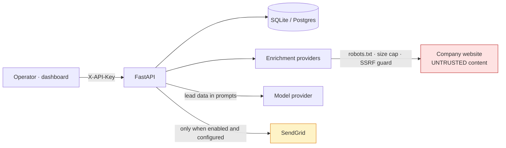

# Threat model

Scope: the FastAPI service in `outreach-architect/` (`/health`, `/ready`, the
lead and campaign routes, `POST /campaigns/{id}/send`, `/analytics/stats`,
`/test/kimi`), the enrichment providers it runs, the delivery path to SendGrid,
the SQLite or Postgres store, and the Vite dashboard in `app/`. Out of scope:
what the model providers (Kimi, DeepSeek, Anthropic, OpenAI) do with the
prompts they receive — lead data reaches them by design, under their terms.

What was open when the work started is stated per threat; "now" is the state
on the `production-readiness` branch after PR #1 and the follow-up commits.

## What it holds

| Asset | Where | Why it matters |
|---|---|---|
| `API_KEY` | environment | Grants every data and action route |
| SendGrid key and sender identity | environment | Sends mail as the operator; sending reputation and cost |
| Model provider keys | environment | Billable |
| Lead data: name, email, company, title, enrichment JSON | `leads` table | Personal data of third parties; regulated (GDPR, CAN-SPAM, CASL) |
| Drafts and the prompts that produced them | `outreach_campaigns` table | Contain the lead's data and the operator's pitch |

## Trust boundaries

Two boundaries matter most. Text fetched from a lead's company website enters
the model's context and shapes the draft; it is written by whoever controls
that site. And the send path is the one irreversible action the service
performs.

## Threats

| # | Threat | Was | Now | Remaining |
|--:|---|---|---|---|
| T1 | Anyone reaching the port sends mail from the operator's SendGrid account | Every route unauthenticated, including `POST /campaigns/{id}/send` | `X-API-Key` on every data and action route, compared in constant time; only `/`, `/health`, `/ready` are open; CI boots the image and asserts the send route answers 401 ([ADR 0001](adr/0001-every-action-route-authenticates-and-sending-is-opt-in.md)) | One shared key; no per-user identity, no rate limit on the HTTP API, no audit log of who sent what |
| T2 | A campaign is reported sent without the operator's decision, or without being sent | `_send_email` marked campaigns `SENT` without reading `EMAIL_SENDING_ENABLED` and without contacting a provider; the documented opt-in was a setting nothing read | `mailer.deliver` checks the gate before any request; `SENT` only after SendGrid answers 202; 409 when disabled, 503 when unconfigured, 502 on rejection, status unchanged in every failure ([ADR 0003](adr/0003-delivery-is-one-gated-function.md)) | No suppression list, unsubscribe handling or consent record — sending stays off by default because of this |
| T3 | SSRF through a lead-supplied `company_website` | Passed straight to `httpx.get`; `http://169.254.169.254/` would have returned cloud instance credentials | Scheme allowlist, blocked hosts, DNS resolution refusing private, loopback, link-local and reserved addresses, `robots.txt`, 512 KB cap; redirects followed by hand with every hop re-checked (the client used to follow them itself, outside the guard) ([ADR 0002](adr/0002-enrichment-providers-behind-a-terms-compliance-gate.md)) | DNS rebinding between the check and the connection; the check is per hostname, not per connection |
| T4 | Prompt injection from a company website into the draft | Page text went into the model's context with no control | Unchanged in kind: the text still reaches the model. The draft is scored (personalisation, length, one clear ask, spam phrasing), held as `ready`, and sent only by a separate authenticated call; auto-send needs both `auto_send=true` and the delivery gate open | No injection-specific filter; the model scores its own draft; a human reading the draft before sending is the control |
| T5 | Provider secrets or internals leak through responses | `/test/kimi` echoed the provider's exception text (endpoint URLs, key fragments) | `/test/kimi` answers a generic 503 and logs the detail; `mailer` never echoes provider text; a test asserts the SendGrid key is absent from every response | Log files hold the detail and need the same access control as the service |
| T6 | Vulnerable dependencies | 18 known advisories across `fastapi`, `starlette`, `requests`, `jinja2`, `python-dotenv` at the pinned versions | All five upgraded; `pip-audit` reports none as of 2026-09-06 and runs in CI with `bandit` | Pins are exact, so the next advisory needs a deliberate bump |
| T7 | Cross-origin abuse from a browser | `allow_origins=["*"]` with `allow_credentials=True` | `CORS_ALLOW_ORIGINS` from configuration; the dev origins by default in development, refused empty in production | — |
| T8 | Lead data at rest and its lifecycle | SQLite in the repository directory; no deletion path | SQLite lives under `/app/data` (a volume) in the container; production refuses SQLite and expects Postgres | Plaintext at rest; no delete route, so an erasure request is a manual database operation; no retention policy |
| T9 | Cost amplification by an authenticated caller | `lead_ids` unbounded; each lead is several model calls; large batches ran in the background with no limit | `lead_ids` bounded to 100 per request, enforced before any model call (422) | `MAX_CONCURRENT_REQUESTS` and `RATE_LIMIT_PER_MINUTE` are settings that nothing enforces |
| T10 | The dashboard exposes the API key | The dashboard sent no key at all, so every call failed once routes were protected | The key comes from `VITE_API_KEY` at build time or is entered in the page and kept in `sessionStorage`; the README says a key in a browser bundle is readable by anyone who can open the page | Single-operator tool; a public deployment needs a backend session instead |
| T11 | The system is mistaken for what its landing page said it was | "15-20% response rates", "500+ companies", testimonials, pricing and an ROI calculator, none backed by anything | The page describes what runs, links the README and this file, and states that no effectiveness number exists; canned model output is labelled `generated_by: canned` | — |

## Failure modes that fail closed

- Production start with the placeholder `API_KEY`, an empty `CORS_ALLOW_ORIGINS`,
  SQLite, or sending enabled without SendGrid settings: refused
  (`Settings.validate_production_settings`).
- An enrichment provider flagged `terms_compliant=False`: cannot be constructed.
- A redirect to a non-public or blocked host: the fetch stops there.
- Sending disabled: 409, campaign unchanged. Provider rejection or outage: 502,
  campaign unchanged.
- No model key: canned responses, labelled; the service still boots and serves
  every read route.
- Removing the LinkedIn-credential settings guard, the SSRF guard or the
  delivery gate: a test fails.
